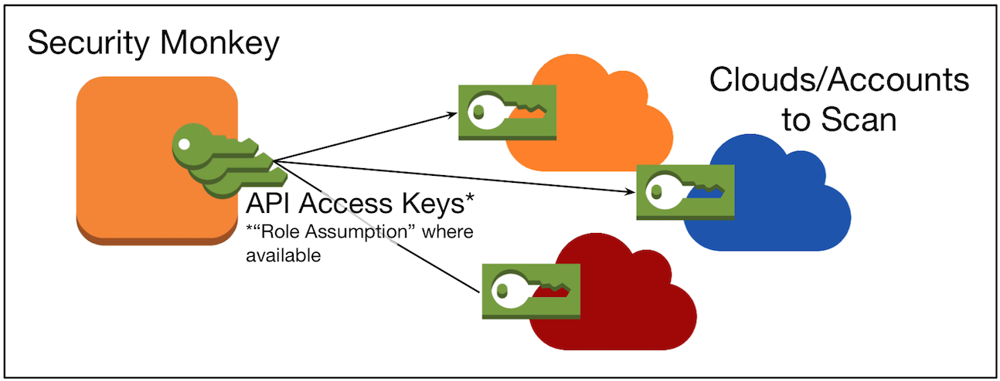

# NOTE: Security Monkey is in maintenance mode and will be end-of-life in 2020.

- For AWS users, please make use of [AWS Config](https://aws.amazon.com/config/).
- For GCP users, please make use of [Cloud Asset Inventory](https://cloud.google.com/resource-manager/docs/cloud-asset-inventory/overview).

Security Monkey
===============

Security Monkey monitors your [AWS and GCP accounts](https://medium.com/@Netflix_Techblog/netflix-security-monkey-on-google-cloud-platform-gcp-f221604c0cc7) for policy changes and alerts on insecure configurations.  Support is available for OpenStack public and private clouds.  Security Monkey can also watch and monitor your GitHub organizations, teams, and repositories.

It provides a single UI to browse and search through all of your accounts, regions, and cloud services.  The monkey remembers previous states and can show you exactly what changed, and when.

Security Monkey can be extended with [custom account types](docs/plugins.md), [custom watchers](docs/development.md#adding-a-watcher), [custom auditors](docs/development.md#adding-an-auditor), and [custom alerters](docs/misc.md#custom-alerters).

It works on CPython 2.7. It is known to work on Ubuntu Linux and OS X.

| Develop Branch  | Master Branch |
| ------------- | ------------- |
|   |   |
|   |  |

### Special Note:
Netflix's support for Security Monkey has been reduced for minor bug fixes only. That being said, we are happy to accept and merge pull-requests that fix bugs and add new features as appropriate.

🚨⚠️🥁🎺 PLEASE READ: BREAKING CHANGES FOR 1.0 🎺🥁⚠️🚨
--------------
If you are upgrading to 1.0 for the first time, please review the [Quickstart](docs/quickstart.md) and the [Autostarting](docs/autostarting.md)
documents as there is a new deployment pattern for Security Monkey. Also, new IAM permissions have been added.

Project resources
-----------------

- [Security Monkey Architecture](docs/architecture.md)
- [Quickstart](docs/quickstart.md)
- [User Guide](docs/userguide.md)
- [Upgrading](docs/update.md)
- [Changelog](docs/changelog.md)
- [Source code](https://github.com/netflix/security_monkey)
- [Issue tracker](https://github.com/netflix/security_monkey/issues)
- [Gitter.im Chat Room](https://gitter.im/Netflix/security_monkey)
- [CloudAux](https://github.com/Netflix-Skunkworks/cloudaux)
- [PolicyUniverse](https://github.com/Netflix-Skunkworks/policyuniverse)
- [Troubleshooting](docs/troubleshooting.md)

Instance Diagram
---------------
The components that make up Security Monkey are as follows (not AWS specific):

Access Diagram
------------
Security Monkey accesses accounts to scan via credentials it is provided ("Role Assumption" where available).

