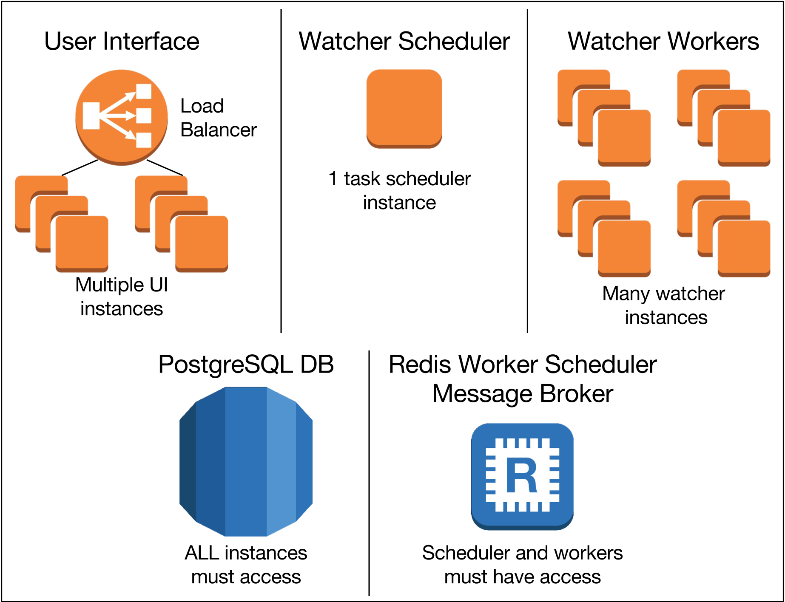

Autostarting Security Monkey
===============================================

This document outlines how to configure Security Monkey to:

1. Automatically run the API
1. Automatically scan for changes in your environment.
1. Configure Security Monkey to send scanning performance metrics

Each section is important, please read them thoroughly.

Celery and The Supervisor
------------
Security Monkey makes use of the excellent [Celery Distributed Task Queue for Python](http://docs.celeryproject.org/en/latest/index.html),
and [Supervisord](http://supervisord.org/) (hence referred to as the Supervisor) for automatically starting the required components
to make Security Monkey function.

In general:
1. The Supervisor ensures that there is always a Security Monkey related process running.
1. Celery is used to manage the scheduling of worker instances to fetch and audit details
   of your accounts.

For each, a sample Supervisor configuration is included. More details is provided in each section below.

🚨⚠️🥁🎺 IMPORTANT PLEASE READ 🎺🥁⚠️🚨
-------------
The recommended deployment strategy of Security Monkey is to have 3 types of instances:
1. 1 or many UI instances behind a load balancer
1. Exactly ONE "scheduler" instance (more on that below)
1. 1 or many "worker" instances that fetch details about the environment.
1. A Redis cache (recommended -- it's easy and works great) to act as a message broker for the scheduler and workers to orchestrate task executions.

*DO NOT* mix the "scheduler" and "worker" instances together -- unless you only want 1 instance doing everything
(not recommended -- it doesn't scale).

Each function should exist on separate instances. If you followed the quickstart guide, now is a good time
to make an image of your instance/container and clone new ones to provide the separate configurations.

For AWS, you can make an AMI off of your Security Monkey instance, and even create separate launch
configurations and auto-scaling groups.

Below is a diagram of the components required by Security Monkey (these are not AWS specific):


Autostarting the API and UI
--------------------

The UI and API go hand-in-hand. The UI is started by NGINX, and the API is autostarted by the Supervisor.

All sample supervisor configurations are stored in the [`supervisor`](https://github.com/Netflix/security_monkey/tree/develop/supervisor)
location. For the UI, you will care about `security_monkey_ui.conf`(https://github.com/Netflix/security_monkey/tree/develop/supervisor/security_monkey_ui.conf).

This file needs to be copied over to the supervisor configuration directory at `/etc/supervisor/conf.d/`.

To enable NGINX and the supervisor, run the following commands (these also set the proper permissions):

    sudo chgrp -R www-data /var/log/security_monkey
    sudo cp /usr/local/src/security_monkey/supervisor/security_monkey_ui.conf /etc/supervisor/conf.d/security_monkey_ui.conf
    sudo systemctl enable nginx
    sudo systemctl enable supervisor
    sudo systemctl start nginx
    sudo systemctl start supervisor
    sudo supervisorctl status

The `supervisorctl status` should output details about the loaded supervisor job.

*Note:* If you make a change to a supervisor configuration, you will need to reload the supervisor service:
`sudo systemctl reload supervisor`

The supervisor will run the Security Monkey's Python [gunicorn](http://gunicorn.org/) command that launches the API (which runs the `monkey run_api_server` command.).

You can track progress by tailing `/var/log/security_monkey/securitymonkey.log`.

The Scheduler
--------------
The scheduler is used to configure the Celery workers. This schedules jobs onto a queue (message broker) which the Celery workers
then use to fetch the tasks to work on in the proper intervals.

### The Message Broker (queue)
Celery has several options for configuring a message broker, which is [documented in detail here](http://docs.celeryproject.org/en/latest/getting-started/brokers/).

We recommend [Redis](https://redis.io/) as it's simple to configure. For AWS, recommend ElastiCache with Redis. We have instructions for setting up
[ElastiCache instructions here](elasticache_directions.md).

Security Monkey by default will install the `redis`, and `celery[redis]` packages. If you wish to install
a different broker, you will need to follow the Celery documentation to install the proper dependencies.

If you wish to use Redis on `localhost` (scheduler instance only), firewall rules need to be established to permit the worker
instances access to it. An external Redis cache will also need to have
firewall rules to permit worker instances access. This is documented in the above instructions for ElastiCache.

If installing on the `localhost` of the scheduler instance, you will need to install Redis on the instance (this is complete if following the quickstart guide).

### Celery Configuration
You will need to modify the `security_monkey/celeryconfig.py` file that is stored in the base Security Monkey location
at `/usr/local/src/security_monkey/security_monkey/celeryconfig.py`(https://github.com/Netflix/security_monkey/blob/develop/security_monkey/celeryconfig.py).

This file looks like this:
```
# Broker source: Place yours here:
broker_url = 'redis://localhost:6379/0'     # Default assume Redis on localhost

# List of modules to import when the Celery worker starts.
imports = ('security_monkey.task_scheduler.tasks',)

# How many processes per worker instance?
worker_concurrency = 10

timezone = "UTC"
enable_utc = True

###########################
# IMPORTANT: This helps avoid memory leak issues - do not change this number!
worker_max_tasks_per_child = 1
############################
```

Only modify the `broker_url` path to point to the path to the broker you use. The default is
configured to a `localhost` Redis.

You may optionally adjust the `worker_concurrency`, which set the number of processes on an instance that the workers will
use to fetch and audit your accounts.

#### Tuning the scheduler
The scheduler will register its periodic tasks with the selected interval (default 1 hour) beginning when the scheduler starts. Another option is to register the periodic tasks at a full hours. This is controlled via the variable `schedule_at_full_hour` which is per default False. The latter option has the benefit that the execution time of tasks are more deterministic which comes in handy particularly when using [alerter](./misc.md#custom-alerters). The downside of this option is that in worst case the execution of the initial task can take twice the interval.

### Supervisor
With the message broker configured, it's now time to copy over the supervisor configuration.
A sample is provided at: `security_monkey_scheduler.conf`(https://github.com/Netflix/security_monkey/tree/develop/supervisor/security_monkey_scheduler.conf)

Run the following commands to set this up:

    sudo chgrp -R www-data /var/log/security_monkey
    sudo cp /usr/local/src/security_monkey/supervisor/security_monkey_scheduler.conf /etc/supervisor/conf.d/security_monkey_scheduler.conf
    sudo systemctl enable supervisor
    sudo systemctl start supervisor
    sudo supervisorctl status

The supervisor configuration will start the Celery `beat` service, which performs all the scheduling logic. 
The full command that the supervisor runs to launch the the `beat` service is:
 ```
 /usr/local/src/security_monkey/venv/bin/celery -A security_monkey.task_scheduler.beat.CELERY beat -s /tmp/sm-celerybeat-schedule -l debug
 ```

Running this command will first purge out all existing jobs from the message broker and start fresh. This is
necessary when editing watcher frequency and enablement.

*Note*: There should be exactly ONE instance that runs `beat`. Running more than one will cause issues. 
See deployment strategy below for additional details.

The Workers
----------
The workers are instances that fetch data from your configured accounts. These are instances that will:
1. Fetch changes in your accounts
1. Audit the changes
1. Send out reports

You are able to deploy as many workers as you like for your environment.  Security Monkey splits up tasks based on the account and technology pair.

Similar to configuring the Scheduler above, the workers need to have the **same** `security_monkey/celeryconfig.py` as the scheduler. In here, you can optionally configure
the number of processes that exist within each instance (via the `worker_concurrency` configuration). By default 10 is selected. You can adjust this as necessary. In general, if you would like to 
scale horizontally, you should deploy more worker instances. This will allow for maximum parallelization.

### Supervisor

A sample Supervisor configuration is provided at `security_monkey_workers.conf`(https://github.com/Netflix/security_monkey/tree/develop/supervisor/security_monkey_workers.conf)
that will automatically run the Celery worker processes for you.

Run the following commands to set this up:

    sudo chgrp -R www-data /var/log/security_monkey
    sudo cp /usr/local/src/security_monkey/supervisor/security_monkey_workers.conf /etc/supervisor/conf.d/security_monkey_workers.conf
    sudo systemctl enable supervisor
    sudo systemctl start supervisor
    sudo supervisorctl status


Supervisor will run the Celery `worker` command, which is:
```
 /usr/local/src/security_monkey/venv/bin/celery -A security_monkey.task_scheduler.tasks.CELERY worker
```

**Note:** Please do not run this on the same instance as the scheduler. Exactly one scheduler should exist. There can be many worker instances,
so keep the supervisor configurations on these instances separate.


Configure Security Monkey to send scanning performance metrics
--------------------------------------------------------------
Security Monkey can be configured to send metrics when objects are added or removed from the scanning queue.  This allows operators to check Security Monkey performance and ensure that items are being processed from the queue in a timely manner.  To do so set `METRICS_ENABLED` to `True`.  You will need `cloudwatch:PutMetricData` permission.  Metrics will be posted with the namespace `securitymonkey` unless configured using the variable `METRICS_NAMESPACE`.  You will also want to set `METRICS_POST_REGION` with the region you want to post CloudWatch Metrics to (default: `us-east-1`).


Deployment Strategies
--------------------
A typical deployment strategy is:
1. Deploy the UI behind a Load Balancer
1. Tear-down the scheduler instance
1. Tear-down all worker instances
1. *At this point, you should perform any database migrations and upgrades as there are no workers that will be affected.*
1. Deploy the new scheduler instance -- wait for it to come online
1. Deploy many worker instances

Performing the steps in this order will ensure:
- That no duplicate schedulers are running (multiple schedulers running causes havoc)
- Proper DB upgrades occur without possibly impacting workers mutating the database
- The schedulers and workers are working properly together
