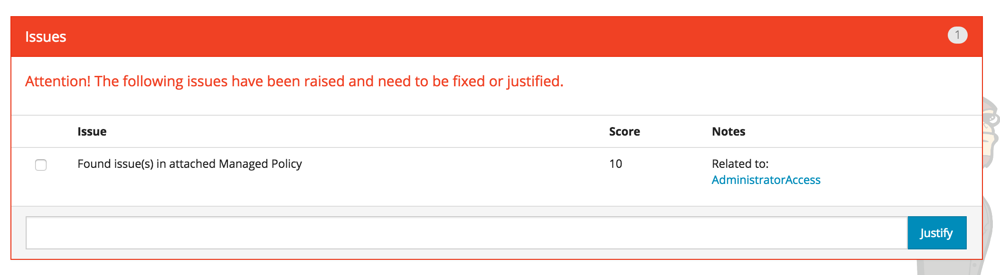

Development Guidelines
======================

Adding a Watcher
----------------

Watchers are located in the [watchers](../security_monkey/watchers/) directory. Some related watcher types are grouped together in common sub directories. An example would be IAM types.

If a watcher is specific to an organization and is not intended to be contributed back to the OSS community, it should be placed under the watchers/custom directory.

Any class that extends Watcher, overrides index and is located under the watchers directory will be dynamically loaded by the Security Monkey application at runtime.

All watchers extend the Watcher class located in the [watcher.py](../security_monkey/watcher.py) file. This base class implements common functionality such as storing items to the database and determining which items are new, changed or deleted. Some related watchers also have a common base class to implement common functionality. Examples would be IAM watchers.

Each watcher implementation must override the following:

1.  The slurp() method pulls the current set of items in scheduled intervals.
2.  The watcher should implement a subclass of the ChangeItem found in the watcher module that is specific to the type the watcher will be pulling in the slurp method
3.  The member variables index must be overridden with a unique String that will identify the item type in the database.
4.  the member variables i\_am\_singular and i\_am\_plural must be overridden with unique values for use in logging.

Watchers may benefit from using the joblib library to parallelize the processing of jobs. This will substantially increase performance of the watcher, especially for those requiring multiple API calls to fetch relevant data. Refer to [IAMRole Watcher](../security_monkey/watchers/iam/iam_role.py) for an example.

Sample Watcher structure:

    from security_monkey.watcher import Watcher
    from security_monkey.watcher import ChangeItem

    class Sample(Watcher):
        index = 'sample'
        i_am_singular = 'Sample'
        i_am_plural = 'Samples'

    def __init__(self, accounts=None, debug=False):
        super(Sample, self).__init__(accounts=accounts, debug=debug)

    def slurp(self):
        # Look up relevant items, convert to list of SampleItem's, return list

    class SampleItem(ChangeItem):
        def __init__(self, account=None, name=None, region=None, config={}):
            super(SampleItem, self).__init__(
                    index=Sample.index,
                    region=region,
                    account=account,
                    name=name,
                    new_config=config)

New Watchers may also require additional code:

-   If the api to access the system to be watched requires an explicit connection, connection functionality should be placed in the [sts\_connect](../security_monkey/common/sts_connect.py) module.

### Adding an Auditor

A watcher may have one or more associated Auditors that will be run against all new or modified items to determine if there are any security issues. In order to be associated with a Watcher, the auditor class must override the index to match that of it's associated watcher.

If an auditor is specific to an organization and is not intended to be contributed back to the OSS community, it should be placed under the auditors/custom directory.

Any class extending Auditor, overriding index and residing under the [auditors](../security_monkey/auditors/) directory. will be dynamically loaded and considered for execution agains a watcher. As with the related watchers, closely related auditors may be grouped within sub directories or have base classes with common functionality.

All auditors override the [Auditor](../security_monkey/auditor.py) base class. Minimal functionality would override the index, i\_am\_singular and i\_am\_plural to match those in the associated watcher class. In addition, at least one method starting with 'check\_' would be present, as each method starting with 'check\_' will be run against new or changed items returned by the watcher:

    from security_monkey.watchers.sample import Sample

    class SampleAuditor(Auditor):
        index = Sample.index
        i_am_singular = Sample.i_am_singular
        i_am_plural = Sample.i_am_plural

        def __init__(self, accounts=None, debug=False):
            super(SampleAuditor, self).__init__(accounts=accounts, debug=debug)

        check_xxx(self, sample_item):
            # check the item for security risks
            if risk:
                self.add_issue(0, 'issue message', sample_item, notes='optional notes')

If an issue is found, the 'check\_' method should call add\_issue to save the issue to the database.

### Advanced Auditor Dependencies

In some cases, an auditor needs information from technology types other than that of the associated watcher to determine if there is a security risk. One example is the determination of whether or not a route table is open to the internet. This requires the ability to match a route gateway with the results of the VPC internet gateway returned by the VPC watcher. The Auditor base class provides the method get\_watcher\_support\_items() to make the current results from one watcher available to another. In order to easily track which watchers and auditors are dependent on each other, an additional configuration is required in the in the Auditor class:

    class SampleAuditor(Auditor):
        index = Sample.index
        i_am_singular = Sample.i_am_singular
        i_am_plural = Sample.i_am_plural
        support_watcher_indexes=[DependencyWatcher.index]

Without this declaration the call to get\_watcher\_support\_items() will fail.

There are instances where auditor logic is dependent not just on the items from other watchers, but also on the actual audit results. One example would be an IAM Group which was configured to use an AWS managed policy. If the managed policy contained a security risk, that risk would also be present in IAM Groups using this policy. The concept of auditor hierarchies was introduces to manage this.

The base Auditor object contains a method called get\_auditor\_support\_items() that is similar to get\_watcher\_support\_items() except that in addition to the items returned by the watcher, it also returns the latest audit results for each item. This introduces the risk of circular dependencies because if AuditorA is dependent on AuditorB, in order to make AuditorB results available when AuditorA is run:

1.  AuditorB must be run before AuditorA and
2.  AuditorB cannot be dependent an AuditorA, nor may any dependencies of AuditorB be dependent on AuditorA

In order to manage this, the the auditor class required a list of dependent auditors to be declared:

    class SampleAuditor(Auditor):
        index = Sample.index
        i_am_singular = Sample.i_am_singular
        i_am_plural = Sample.i_am_plural
        support_auditor_indexes=[DependencyAuditor.index]

Without this declaration the call to get\_auditor\_support\_items() will fail.

However, if any circular dependencies are detected the system will throw an exception with the the message at startup:

    Detected circular dependency in support auditor {path of circular dependency}

### Linking to Auditor Dependencies

Typically, if an audit issue is dependent on another one, a the two should be linked:

This can be achieved by the [Auditor](../../security_monkey/auditor.py) link\_to\_support\_item\_issues() method.

Custom Account Types
--------------------

By default, Security Monkey runs against a basic AWS account but the custom account framework allows the developer to either extend an AWS account with additional metadata or to create a totally different account type to be monitored, such as an Active Directory account.

All account types extend the [AccountManager](../security_monkey/account_manager.py) class and are located in the [account\_managers](../security_monkey/account_managers/) directory. Account types specific to an organization which are not intended to be contributed back to the OSS community should be placed in the [account\_managers/custom](../security_monkey/account_managers/custom) directory.

### Data Structure

The account contains five common fields:

-   name is the Security Monkey application defined name
-   identifer is unique identifier of the account used to connect. For AWS accounts this would be the number
-   active is a flag that determines whether to report on the account
-   notes additional account information
-   third\_party AWS specific field that is used in Auditor.\_check\_cross\_account

When creating a custom account type, additional fields may be added using the account\_manager.CustomFieldConfig objects which is used to display the fields on the Account Settings page:

    class CustomFieldConfig(object):
        """
        Defines additional field types for custom account types
       """
       def __init__(self, name, label, db_item, tool_tip, password=False):
          super(CustomFieldConfig, self).__init__()
          self.name = name
          self.label = label
          self.db_item = db_item
          self.tool_tip = tool_tip
          self.password = password

Values created from this page are saved in the DB using the datastore.AccountTypeCustomValues class is the db\_item flag is True.

### Creating a Custom Account Type

Custom account types must override three values:

-   account\_type is a unique identifier for the type which is also used in the Watcher class to determine which watcher(s) to run against which account(s).
-   identifier\_label is used in the Account Settings page to display the label for the unique identifier for the account.
-   identifier\_tooltip is also used in the Account Settings page.

The following overrides are optional:

-   compatable\_account\_types is a list that will cause watchers of these account types to also be run against the account. This is used when an account type overrides another account type to add additional data elements.
-   custom\_field\_configs adds additional fields as described above
-   def \_load(self, account): this method is called to load custom fields from some third party datasource when the CustomFieldConfig.db\_item field is defined as False

Examples of these overrides are available at:

-   [Sample Active Directory Account Type](../security_monkey/account_managers/custom/sample_active_directory.py)
-   [Sample Active DB Extended AWS Account Type](../security_monkey/account_managers/custom/sample_db_extended_aws.py)
-   [Sample Active External Extended AWS Type](../security_monkey/account_managers/custom/sample_extended_aws.py)

