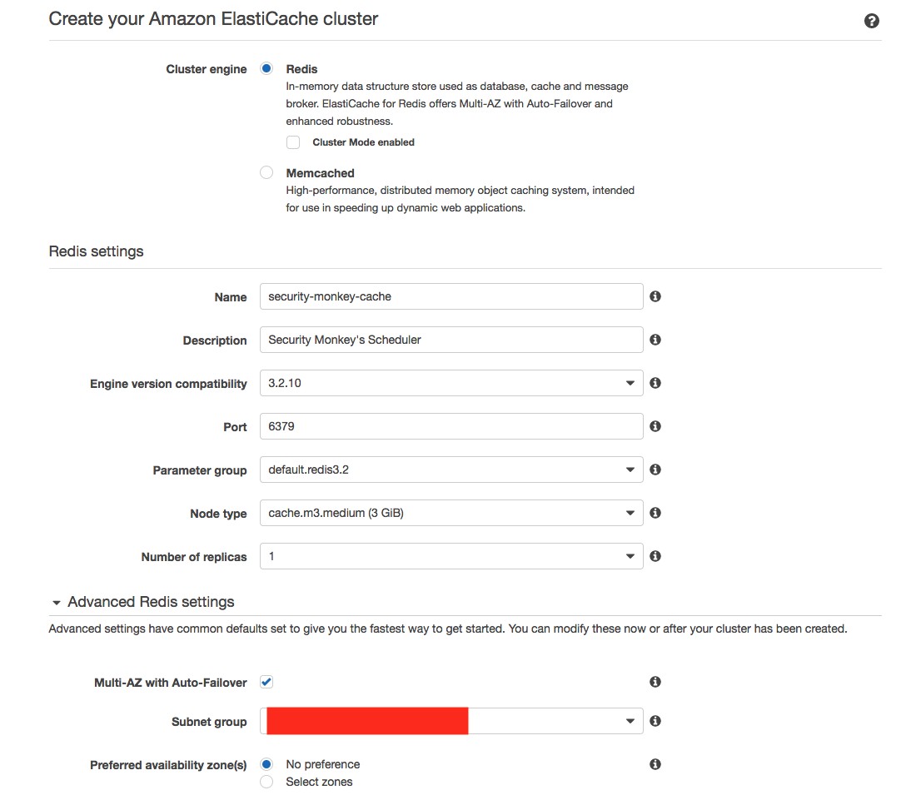

AWS ElastiCache Directions for Redis backed Celery Message Brokers
==================================================================

We recommend using Redis as a message broker for Security Monkey. If deployed on AWS, it's best to make use of [AWS ElastiCache](https://aws.amazon.com/elasticache/).

This will outline some directions on what you will need to have set-up.

Create a Security Group
-----------------------
Similar to the setup for RDS, you will need to make a security group for ElastiCache.

1. Create a security group named `securitymonkey-cache` that lives in the *same VPC and region* as the existing `securitymonkey` security group created.
1. In the security group, add a new rule to permit `securitymonkey` ingress on TCP port 6379

Create the ElastiCache Cluster
-----------------------------
Go to the AWS console to create an AWS ElastiCache Cluster.  We are going to create a cluster in the same VPC and region that Security Monkey resides.

1. Create a Redis Cluster. Most of the defaults are fine. However, you will likely not need something massive. A standard M3 medium should be fine
   for the majority of use cases.
  
1. For Your `Advanced Redis settins`, ensure that it's placed in a subnet group that is within the same VPC as Security Monkey
1. For `Security`, attach the `securitymonkey-cache` security group created earlier
1. For `Backup and Maintenance`, automatic backups are probably not needed.
1. For `Maintenance` the defaults are sufficient.
1. Click `Create`
1. Wait for AWS to provision your cluster.

Cache URL
----------
You will now need to grab the URL to the ElastiCache cluster. Once AWS has completed provisioning your cluster, you will
need find the `Primary Endpont` (visible by selecting the cluster in the console), and paste that into 
your `celeryconfig.py` file. This is the path to the ElastiCache cluster that Celery will use for scheduling and worker management.

For Redis, the path needs to be set for the `broker_url` variable in the `celeryconfig.py` file needs to be in the format of:
```
broker_url = 'redis://<COPY-THE-ENDPOINT-PATH-HERE>'
```

After you make the changes to your Celery configuration, re-deploy Security Monkey.

Troubleshooting
--------------
If the security monkey scheduler and workers hang on start-up, it's likely the security groups are incorrectly configured.
Please ensure that the Redis instance has the proper security group attached, and that the security monkey workers and scheduler
instances are deployed with a security group that is ingressed properly to the ElastiCache security group.
