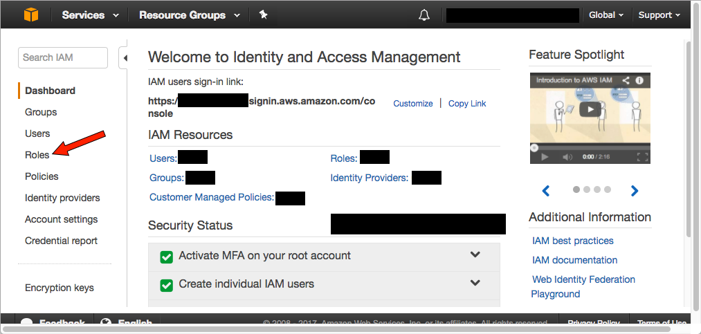
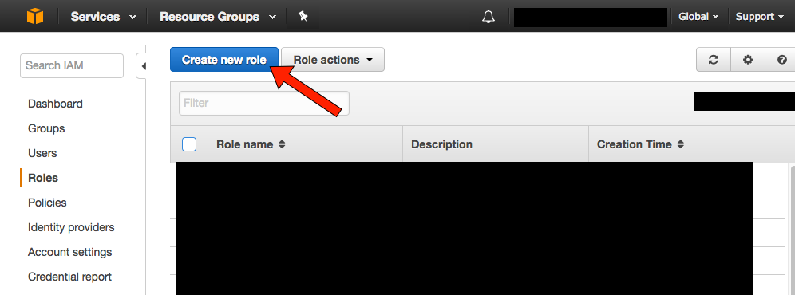
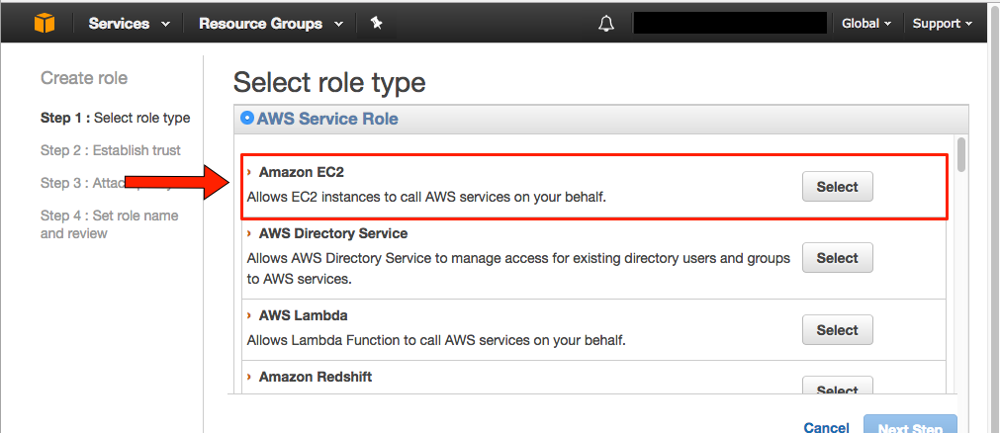
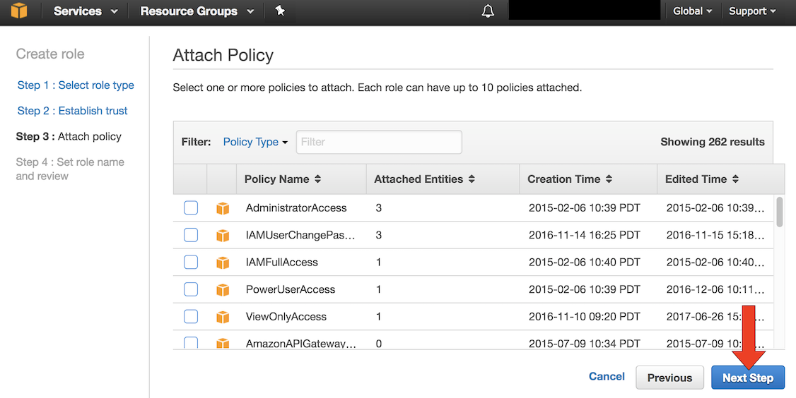
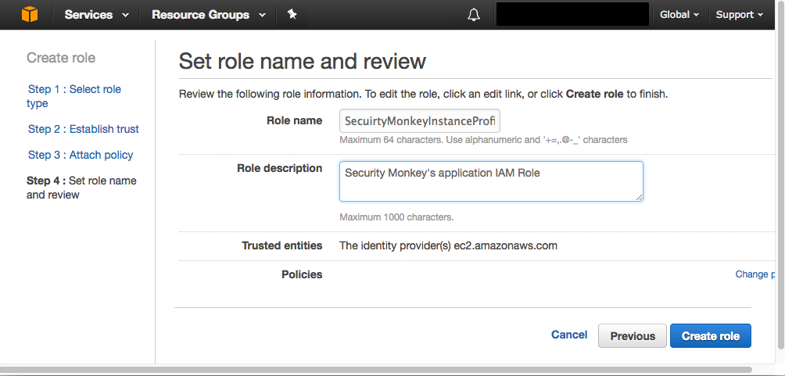
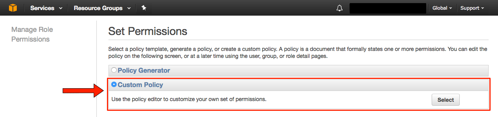
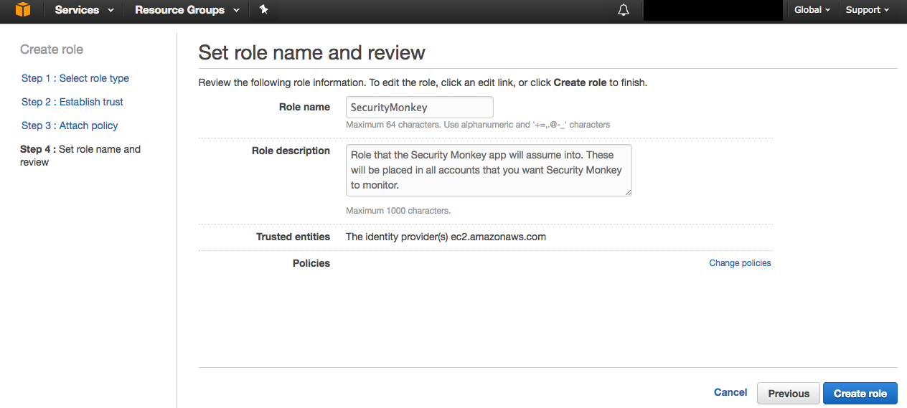
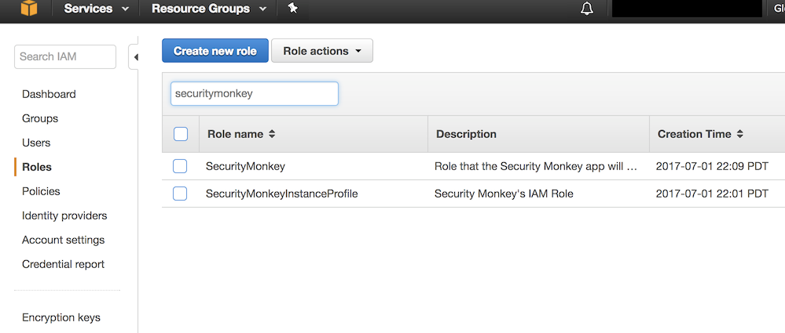
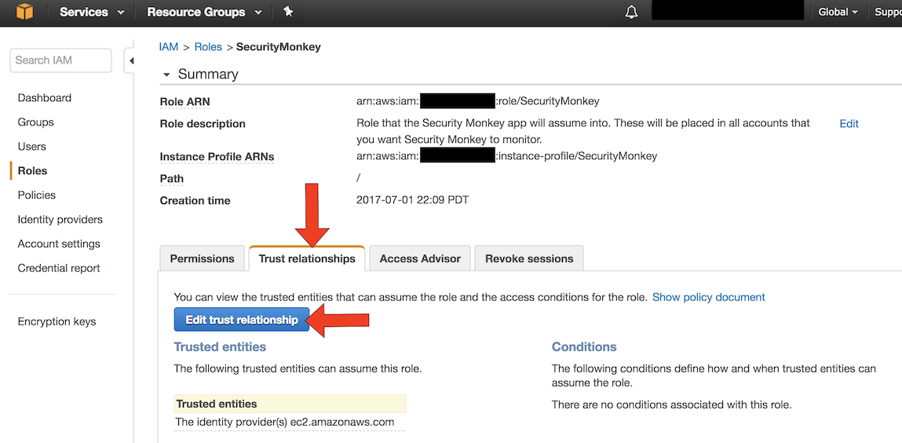

IAM Role Setup on AWS
=====================

We need to create two roles for security monkey. The first role will be an instance profile that we will launch security monkey into. The permissions on this role allow the monkey to use STS to assume to other roles as well as use SES to send email.

Creating the `SecurityMonkeyInstanceProfile` IAM Role
-------------------------------------------
`SecurityMonkeyInstanceProfile` is an IAM role that the Security Monkey instance will operate as. This role
has a limited set of permissions. The `SecurityMonkey` role (created later) will have the majority of permissions,
and will be placed in all AWS accounts that you wish to manage (including the account that the Security Monkey app operates in).

1. To create a new Role, navigate to the IAM section of the AWS console. Once there, select "Roles":


1. Once there, click "Create Role":


1. You will be asked to select the type of role to create. We are going to create an `AWS Service Role` for `Amazon EC2`:


1. You will be asked to attach a (managed) policy (`Attach Policy` page). Please skip this step by clicking `Next Step`.


1. At the next screen, you will type in the name of the IAM role and provide a description. Please name the role `SecurityMonkeyInstanceProfile`. Then, click `Create Role` See the following screenshot:


At this point, you now have a new IAM role named `SecurityMonkeyInstanceProfile`. This is the IAM role that the Security Monkey application will operate as. However, the role lacks permissions. We will need to add some permissions to make this role useful.

### Grant the `SecurityMonkeyInstanceProfile` Permissions ###

1. In the IAM Role section of the AWS console, search for the `SecurityMonkeyInstanceProfile`, and click on the IAM role name. You should see something similar to:


1. You will need to create an inline policy, to do this, select `Inline Policies`, then `click here`:


1. Next, we are going to copy and paste in an IAM policy. So, you want to select `Custom Policy`:


1. Finally, you will add in the policy. Under `Policy Name`, supply: `SecurityMonkeyLaunchPerms`, and for the `Policy Document`, paste in:
    ```
    {
        "Version": "2012-10-17",
        "Statement": [
            {
                "Effect": "Allow",
                "Action": "ses:SendEmail",
                "Resource": "*"
            },
            {
                "Effect": "Allow",
                "Action": "sts:AssumeRole",
                "Resource": "arn:aws:iam::*:role/SecurityMonkey"
            }
        ]
    }
    ```

1. Click `Apply Policy`.

Creating SecurityMonkey Role
----------------------------
You must now create the `SecurityMonkey` role that will actually be used to fetch the details about your AWS account.
You will need to create this role in all AWS accounts that you want to monitor.

1. Create a new IAM role with the `AWS Service Role` type for `Amazon EC2`.

1. Skip attaching a managed policy (simply click `Next Step` at the `Attach Policy` page).

1. Create a new IAM role and name it `SecurityMonkey`:


1. Once you create the role, you will need to add a new inline policy to it. Search for the `SecurityMonkey` IAM role, and select it for editing.

1. You will add in the following custom inline custom policy named `SecurityMonkeyReadOnly`:
    ```
    {
        "Version": "2012-10-17",
        "Statement": [
            {
                "Action": [
                    "acm:describecertificate",
                    "acm:listcertificates",
                    "cloudtrail:describetrails",
                    "cloudtrail:gettrailstatus",
                    "config:describeconfigrules",
                    "config:describeconfigurationrecorders",
                    "directconnect:describeconnections",
                    "ec2:describeaddresses",
                    "ec2:describedhcpoptions",
                    "ec2:describeflowlogs",
                    "ec2:describeimages",
                    "ec2:describeimageattribute",
                    "ec2:describeinstances",
                    "ec2:describeinternetgateways",
                    "ec2:describekeypairs",
                    "ec2:describenatgateways",
                    "ec2:describenetworkacls",
                    "ec2:describenetworkinterfaces",
                    "ec2:describeregions",
                    "ec2:describeroutetables",
                    "ec2:describesecuritygroups",
                    "ec2:describesnapshots",
                    "ec2:describesnapshotattribute",
                    "ec2:describesubnets",
                    "ec2:describetags",
                    "ec2:describevolumes",
                    "ec2:describevpcendpoints",
                    "ec2:describevpcpeeringconnections",
                    "ec2:describevpcs",
                    "ec2:describevpcattribute",
                    "ec2:describevpcclassiclink",
                    "ec2:describevpcclassiclinkdnssupport",
                    "ec2:describeflowlogs",
                    "ec2:describevpnconnections",
                    "ec2:describevpngateways",
                    "elasticloadbalancing:describeloadbalancerattributes",
                    "elasticloadbalancing:describeloadbalancerpolicies",
                    "elasticloadbalancing:describeloadbalancers",
                    "elasticloadbalancing:describelisteners",
                    "elasticloadbalancing:describerules",
                    "elasticloadbalancing:describesslpolicies",
                    "elasticloadbalancing:describetags",
                    "elasticloadbalancing:describetargetgroups",
                    "elasticloadbalancing:describetargetgroupattributes",
                    "elasticloadbalancing:describetargethealth",
                    "es:describeelasticsearchdomainconfig",
                    "es:listdomainnames",
                    "glacier:DescribeVault",
                    "glacier:GetVaultAccessPolicy",
                    "glacier:ListTagsForVault",
                    "glacier:ListVaults",
                    "iam:getaccesskeylastused",
                    "iam:getaccountsummary",
                    "iam:getgroup",
                    "iam:getgrouppolicy",
                    "iam:getloginprofile",
                    "iam:getpolicyversion",
                    "iam:getrole",
                    "iam:getrolepolicy",
                    "iam:getservercertificate",
                    "iam:getuser",
                    "iam:getuserpolicy",
                    "iam:listaccesskeys",
                    "iam:listattachedgrouppolicies",
                    "iam:listattachedrolepolicies",
                    "iam:listattacheduserpolicies",
                    "iam:listentitiesforpolicy",
                    "iam:listgrouppolicies",
                    "iam:listgroups",
                    "iam:listinstanceprofilesforrole",
                    "iam:listmfadevices",
                    "iam:listpolicies",
                    "iam:listrolepolicies",
                    "iam:listroles",
                    "iam:listroletags",
                    "iam:listsamlproviders",
                    "iam:listservercertificates",
                    "iam:listsigningcertificates",
                    "iam:listuserpolicies",
                    "iam:listusers",
                    "kms:describekey",
                    "kms:getkeypolicy",
                    "kms:getkeyrotationstatus",
                    "kms:listaliases",
                    "kms:listgrants",
                    "kms:listkeypolicies",
                    "kms:listkeys",
                    "lambda:getfunctionconfiguration",
                    "lambda:getpolicy",
                    "lambda:listaliases",
                    "lambda:listeventsourcemappings",
                    "lambda:listtags",
                    "lambda:listversionsbyfunction",
                    "lambda:listfunctions",
                    "rds:describedbclusters",
                    "rds:describedbclustersnapshots",
                    "rds:describedbinstances",
                    "rds:describedbsecuritygroups",
                    "rds:describedbsnapshots",
                    "rds:describedbsnapshotattributes",
                    "rds:describedbsubnetgroups",
                    "redshift:describeclusters",
                    "route53:listhostedzones",
                    "route53:listresourcerecordsets",
                    "route53domains:listdomains",
                    "route53domains:getdomaindetail",
                    "s3:getaccelerateconfiguration",
                    "s3:getbucketacl",
                    "s3:getbucketcors",
                    "s3:getbucketlocation",
                    "s3:getbucketlogging",
                    "s3:getbucketnotification",
                    "s3:getbucketpolicy",
                    "s3:getbuckettagging",
                    "s3:getbucketversioning",
                    "s3:getbucketwebsite",
                    "s3:getlifecycleconfiguration",
                    "s3:listbucket",
                    "s3:listallmybuckets",
                    "s3:getreplicationconfiguration",
                    "s3:getanalyticsconfiguration",
                    "s3:getmetricsconfiguration",
                    "s3:getinventoryconfiguration",
                    "ses:getidentityverificationattributes",
                    "ses:listidentities",
                    "ses:listverifiedemailaddresses",
                    "ses:sendemail",
                    "sns:gettopicattributes",
                    "sns:listsubscriptionsbytopic",
                    "sns:listtopics",
                    "sqs:getqueueattributes",
                    "sqs:listqueues",
                    "sqs:listqueuetags", 
                    "sqs:listdeadlettersourcequeues"
                ],
                "Effect": "Allow",
                "Resource": "*"
            }
        ]
    }
    ```

 1. Review and create the new role.

Allow `SecurityMonkeyInstanceProfile` to "Assume" to the `SecurityMonkey` Role.
-------------------------------------------------------------------
For Security Monkey to make use of the `SecurityMonkey` IAM role, it needs to have the ability to 
`Assume` into it. The `SecurityMonkeyInstanceProfile` has `sts:AssumeRole` permissions for all AWS account
roles named `SecurityMonkey`, however, the destination IAM roles also need to permit the source role access to it.
This is specified in a role's `AssumeRolePolicyDocument`. You must alter this to permit the Security Monkey instance the ability
to assume the roles.


At this point, you should have 2 Security Monkey related IAM roles in your account: `SecurityMonkeyInstanceProfile`, and `SecurityMonkey`.:


1. Select the `SecurityMonkey` role for modification.

1. On the IAM role page for `SecurityMonkey`, select `Trust Relationships`, and select `Edit trust relationship`:


1. Paste in the following `Policy Document`:
    ```
    {
        "Statement": [
            {
                "Effect": "Allow",
                "Principal": {
                    "AWS": "arn:aws:iam::<YOUR ACCOUNTID GOES HERE>:role/SecurityMonkeyInstanceProfile"
                },
                "Action": "sts:AssumeRole"
            }
        ]
    }
    ```
    Don't forget to replace `<YOUR AWS ACCOUNT ID GOES HERE>` with your AWS account ID (the account running Security Monkey)!

1. Click `Update Trust Policy`


Adding more accounts
--------------------

To have your instance of security monkey monitor additional accounts, you must add the `SecurityMonkey` role in each account you want to monitor. Follow the instructions above to create the new `SecurityMonkey` role. The `Trust Relationship` policy should have the account ID of the account where the security monkey instance is running.

**Note**

Additional `SecurityMonkeyInstanceProfile` roles are not required. You only need to create new `SecurityMonkey` roles.

**Note**

You will also need to add the new account in the Web UI, and restart the scheduler. More information on how do to this will be presented later in this guide.

Next:
-----

- [Back to the Quickstart](quickstart.md#database)
