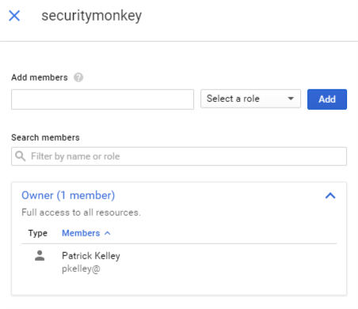

IAM Role Setup on GCP
=====================

Below describes how to install Security Monkey on GCP.

Install gcloud
---------------

If you haven't already, install *gcloud* from the [downloads](https://cloud.google.com/sdk/downloads) page.  *gcloud* enables you to administer VMs, IAM policies, services and more from the command line.

Setup Service Account
---------------------

To restrict which permissions Security Monkey has to your projects, we'll create a [Service Account](https://cloud.google.com/compute/docs/access/service-accounts) with a special role.

- Access the [Google console](https://console.cloud.google.com/home/dashboard).
- Under "IAM & Admin", select "Service accounts."
- Select "Create Service Account".
  - Name: "securitymonkey"
  - Add Role "IAM->SecurityReviewer"
  - Add Role "Project->Viewer"
  - **NOTE**: If you're going to monitor your GCP services from an external system (i.e. an AWS instance), check the box "Furnish a new private key" and ensure JSON is selected as the Key type. The filesystem path to this JSON is what is supplied to the `creds_file` parameter when creating a GCP account.
    - If you are going to be monitoring your GCP services from a GCP instance, then you don't need to generate a key. You will instead launch your GCP instance with this service account.
  - Hit "Create"

 - Select the newly created "securitymonkey" services account and click on "Permissions".
   -  Type in your Google email adddress and select the Owner role.
   -  Press "Add".

Enable IAM API
---------------

For each GCP project you would like Security Monkey to access, you'll need to enable the IAM API.  Visit the [IAM API page](https://console.cloud.google.com/apis/api/iam.googleapis.com/overview) page in the web console
 and click 'Enable API' at the top of the screen. When dealing with many projects, you might prefer to do this with the gcloud command.  For details on how to enable services with gcloud, visit the
  [service-management](https://cloud.google.com/service-management/enable-disable#enabling_services) page.  The IAM service name is 'iam.googleapis.com'.

Next:
-----

- [Back to the Quickstart](quickstart.md#database)