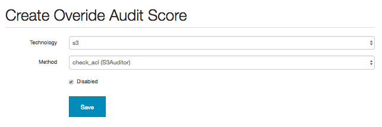
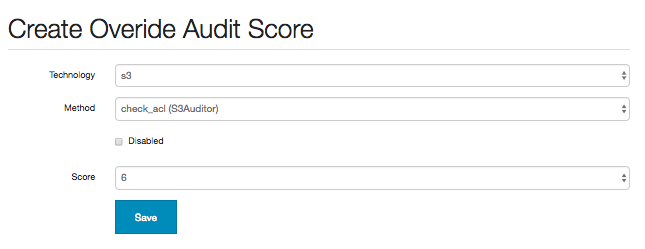
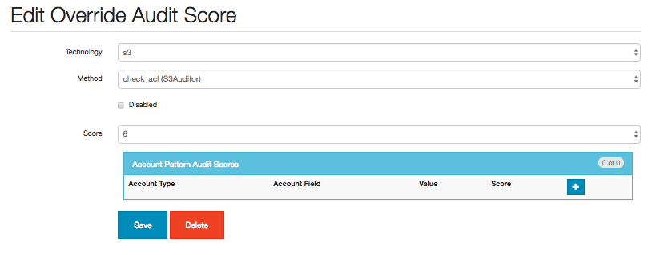
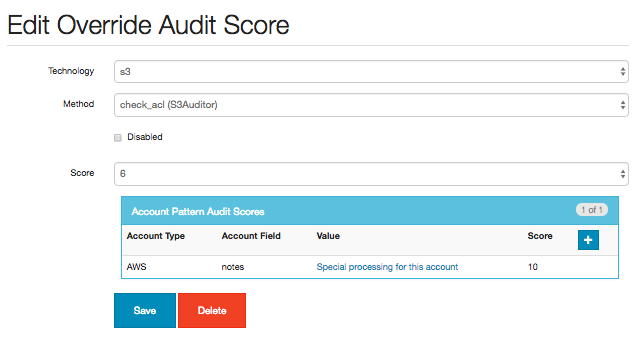

==============
Miscellaneous
==============

Force Audit
-----------
Sometimes you will want to force an audit even though there is no configuration 
change in AWS resources.

For instance when you change a whitelist or add a 3rd party account, configuration
will not be audited again until the daily check at 10am.

In this case, you can force an audit by running:

.. code-block:: bash
   
    export SECURITY_MONKEY_SETTINGS=/usr/local/src/security_monkey/env-config/config-deploy.py
    python manage.py audit_changes -m s3

Be sure to set your SECURITY_MONKEY_SETTINGS environment variable first.

For an email by adding ``-r True``:

.. code-block:: bash

    python manage.py audit_changes -m s3 -r True

Valid values for ``audit_changes -m`` are:
 - elb
 - elasticip
 - elasticsearchservice
 - iamrole, iamssl, iamuser, iamgroup
 - keypair
 - policy
 - redshift
 - rds
 - securitygroup
 - ses
 - sns
 - sqs
 - s3
 - vpc
 - subnet
 - routetable

Scheduler Hacking
-----------------

Edit ``security_monkey/scheduler.py`` to change daily check schedule::

    scheduler.add_cron_job(_audit_changes, hour=10, day_of_week="mon-fri", args=[account, auditors, True])

Edit ``security_monkey/watcher.py`` to change check interval from every 15 minutes

Overriding and Disabling Audit Checks
-------------------------------------

Auditor checks may be disabled or the default scores overridden by navigating to the "Audit Issue Scores" tab on the Settings page.

Audit check functions may be disabled by selecting the auditor's technology and method:

This will result in the check method not being run on the next audit full, which will remove any existing issue previously generated.

The default score of the check method may also be overridden:

This will replace the score of issues generated by this check method with the configured one on the next full audit.

Once an audit score is added it becomes possible to create additional override scores based on account patterns:

The Account Pattern Audit Scores box allows the user to add or update additional conditions for overriding the audit scores:

.. image:: images/create_pattern_check_score.png

The Account Field box is prepopulated with both the standard and non-password type custom fields for the given Account Type.

After saving the pattern score, it will be associated the the Audit Override Score record:

On the next full audit, the score for the configured check method will be replaced with an audit override score from the account pattern list if the account field matches the value.

If no account pattern scores match the account, the override score it will default to the generic override score configured.

Audit override scores may also be set up though the `Command line interface <../manage.py>`_ functions
add_override_score (for a single score) and add_override_scores (from a csv file)

*Note:*::

    Currently there is no implementation of an account pattern field hierarchy, so the first account
    pattern score encountered that matches the account being audited will be used as the override for
    the check method in question. As such, if account pattern scores of different account fields are
    entered for a single check method there is a possibility of unpredictable results and it is recommended
    that only a single field is selected for defining patterns.
