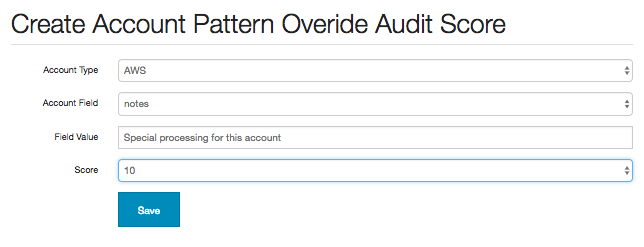

Miscellaneous
=============

Force Audit
-----------

Sometimes you will want to force an audit even though there is no configuration change in AWS resources.

For instance when you change a whitelist or add a 3rd party account, configuration will not be audited again until the daily check at 10am.

In this case, you can force an audit by running:

~~~~ {.sourceCode .bash}
monkey audit_changes -m s3
~~~~

For an email by adding `-r True`:

~~~~ {.sourceCode .bash}
monkey audit_changes -m s3 -r True
~~~~

Scheduler Hacking
-----------------

Edit `security_monkey/scheduler.py` to change daily check schedule:

    scheduler.add_cron_job(_audit_changes, hour=10, day_of_week="mon-fri", args=[account, auditors, True])

Edit `security_monkey/watcher.py` to change check interval from every 15 minutes:

    self.interval = 15
    
Synchronizing Network Whitelists
--------------------------------

Network whitelists can be imported from a JSON file in either an S3 bucket or local file. 

```sh
# add and update networks from an S3 bucket
$ monkey sync_networks -b an-s3-bucket -f networks.json
# in addition to the above, delete any networks not specified in networks.json
$ monkey sync_networks -b an-s3-bucket -f networks.json -a
# or just use a local file
$ monkey sync_networks -f ~/networks.json
```

This JSON file should map between names and CIDRs like so:

```json
{
    "net1": "2620:10D:C000::/40",
    "net2": "199.201.64.0/22",
    "net3": "2a03:2880:f10d:83:face:b00c:0:25de",
}
```

If you're using S3 to store this file, make sure to give SecurityMonkeyInstanceProfile the appropriate policy permissions in IAM. For example, this will allow the example above to run:

```json
{
    "Version": "2012-10-17",
    "Statement": [
        {
            "Sid": "AllowNetworkFileAccess",
            "Effect": "Allow",
            "Action": [
                "s3:GetObject",
            ],
            "Resource": [
                "arn:aws:s3:::an-s3-bucket/networks.json",
            ]
        }
    ]
}
```

Overriding and Disabling Audit Checks
-------------------------------------

Auditor checks may be disabled or the default scores overridden by navigating to the "Audit Issue Scores" tab on the Settings page.

Audit check functions may be disabled by selecting the auditor's technology and method:


This will result in the check method not being run on the next audit full, which will remove any existing issue previously generated.

The default score of the check method may also be overridden:


This will replace the score of issues generated by this check method with the configured one on the next full audit.

Once an audit score is added it becomes possible to create additional override scores based on account patterns:


The Account Pattern Audit Scores box allows the user to add or update additional conditions for overriding the audit scores:



The Account Field box is prepopulated with both the standard and non-password type custom fields for the given Account Type.

After saving the pattern score, it will be associated the the Audit Override Score record:


On the next full audit, the score for the configured check method will be replaced with an audit override score from the account pattern list if the account field matches the value.

If no account pattern scores match the account, the override score it will default to the generic override score configured.

Audit override scores may also be set up though the [Command line interface](../security_monkey/manage.py) functions `add_override_score` (for a single score) and `add_override_scores` (from a csv file)

*Note:*:

    Currently there is no implementation of an account pattern field hierarchy, so the first account
    pattern score encountered that matches the account being audited will be used as the override for
    the check method in question. As such, if account pattern scores of different account fields are
    entered for a single check method there is a possibility of unpredictable results and it is recommended
    that only a single field is selected for defining patterns.

Custom Alerters
---------------

Adding a custom alerter class allows users to add their own alerting anytime changes are found in watchers or auditors. The functionality in the alerter.py module send emails only when the reporter is finished running. The custom alerter reports are triggered when manually running find\_changes and audit\_changes as well as when the reporter runs.

A sample customer alerter would be a SplunkAlerter module that logs watcher and auditor changes to be ingested into Splunk:

~~~~ {.sourceCode .python}
from security_monkey.alerters import custom_alerter


class SplunkAlerter(object):
    __metaclass__ = custom_alerter.AlerterType

    def report_watcher_changes(self, watcher):
        """
        Collect change summaries from watchers defined logs them
        """
        """
        Logs created, changed and deleted items for Splunk consumption.
        """

        for item in watcher.created_items:
            app.splunk_logger.info(
                "action=\"Item created\" "
                "id={} "
                "resource={} "
                "account={} "
                "region={} "
                "name=\"{}\"".format(
                    item.db_item.id,
                    item.index,
                    item.account,
                    item.region,
                    item.name))

        for item in watcher.changed_items:
            app.splunk_logger.info(
                "action=\"Item changed\" "
                "id={} "
                "resource={} "
                "account={} "
                "region={} "
                "name=\"{}\"".format(
                    item.db_item.id,
                    item.index,
                    item.account,
                    item.region,
                    item.name))

        for item in watcher.deleted_items:
            app.splunk_logger.info(
                "action=\"Item deleted\" "
                "id={} "
                "resource={} "
                "account={} "
                "region={} "
                "name=\"{}\"".format(
                    item.db_item.id,
                    item.index,
                    item.account,
                    item.region,
                    item.name))

    def report_auditor_changes(self, auditor):
        for item in auditor.items:
            for issue in item.confirmed_new_issues:
                app.splunk_logger.info(
                    "action=\"Issue created\" "
                    "id={} "
                    "resource={} "
                    "account={} "
                    "region={} "
                    "name=\"{}\" "
                    "issue=\"{}\"".format(
                        issue.id,
                        item.index,
                        item.account,
                        item.region,
                        item.name,
                        issue.issue))

            for issue in item.confirmed_fixed_issues:
                app.splunk_logger.info(
                    "action=\"Issue fixed\" "
                    "id={} "
                    "resource={} "
                    "account={} "
                    "region={} "
                    "name=\"{}\" "
                    "issue=\"{}\"".format(
                        issue.id,
                        item.index,
                        item.account,
                        item.region,
                        item.name,
                        issue.issue))
~~~~
